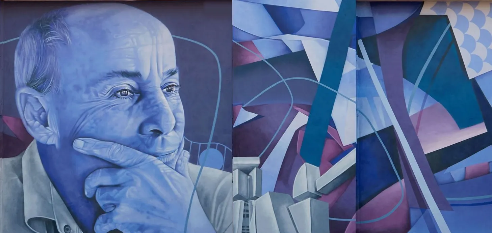

# Hola, mi nombre es Pablo

### *A qué me dedico?*
Soy un estudiante y actualmente me encuentro realizando un ciclo de grado superior de **desarrollo de aplicaciones web** "DAW".

### *Títulos*
- Título de Educación Secundaria Obligatoria
- Título de Bachillerato

### *DAW*
Decidí meterme en el ciclo de DAW debido a que me resultaba interesante el hecho de saber desarrollar y hacer páginas web, y a pesar de que no resultara siendo lo esperado no me desagrada. Este ciclo lo estoy realizando en el **CIFP Cesar Manrique**.

### *Asignaturas*

| Asignaturas | Dificultad |
| ----------- | ---------- |
| Sistemas Informáticos | Fácil |
| Programación | Difícil |
| Inglés | Fácil |
| Lenguaje de Marcas | Medio-Difícil |
| Digitalización | Fácil |
| Entornos de Desarrollos | Medio |
| Base de Datos | Medio-Difícil |
| FOL | Fácil |

### *Introducción DAW*

Si estás interesado en este ciclo, te dejo este vídeo de apoyo que en su momento me resultó útil.
[Introducción](https://youtu.be/dfEEG4A_Hoo?feature=shared)
